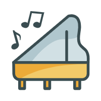
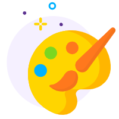
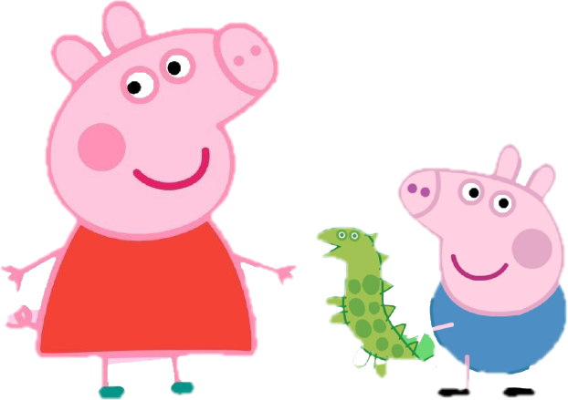

<!DOCTYPE html>
<html lang="en">
<head>
    <meta charset="UTF-8">
    <title>个人网页设计</title>
    <link rel="stylesheet" type="text/css" href="css/main.css">
</head>
<body>
<!--页眉-->
<header id="header">

</header>
<!--导航栏-->

    <nav>
        <ul>
            <li class="selected"><a href="index.html">个人主页</a></li>
            <li><a href="blog.html">个人日志</a></li>
            <li><a href="invention.html">我的荣誉</a></li>
            <li><a href="life.html">校园生活</a></li>
            <li><a href="">我的家乡</a></li>
        </ul>
    </nav>

<!--内容-->

    

        <!--边栏区-->
        

            

我的爱好

            
            
弹钢琴

            
我从三岁的时候开始学习钢琴。学习钢琴的过程虽然非常枯燥，但是它也让我获得了很多快乐。

            
            
看电影

            
闲暇的时候喜欢看几部电影，放松一下。我喜欢的电影有很多很多，希望可以和你一起分享！

            
            
绘画

            
绘画也是一项我很擅长很喜欢的活动！因为在绘画的时候可以沉浸在自己一个人的世界里，我很喜欢绘画时候的感觉。

        

        <!--内容区-->
        

            <a href="more.html" style="float: right;margin-top: 15px;margin-right: 25px;font-size: 13px;font-family: 黑体;">了解更多</a>
            <h2 style="text-align: center;margin-top: 40px;font-size: 20px;color: #FFC0CB;font-family: 黑体;font-weight: bold">终于等到你啦！欢迎来到我的主页！</h2>

            

                
            

            

                
既然来了，就留下来看看再走叭~

                

                
这是一段简单的自我介绍 

                

                    <ul>
                        <li>喜欢各种美食, 探索每个地方的一切好吃的</li>
                        <li>会弹钢琴, 已经考过了钢琴十级啦</li>
                        <li>喜欢绘画, 比较擅长的种类是动画，素描</li>
                        <li>很热心，看到别人有困难会毫不犹豫的帮助, 但是有一点点的慢热</li>
                    </ul>
                

            

        

    

<!--页脚-->

Web Personal Website Design

</body>
</html>
